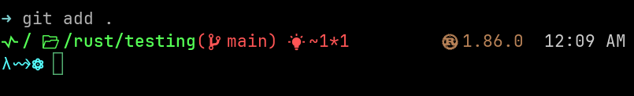

<h1 align="center">Photoelectric Theme for Oh My Posh ⚡</h1>

A visually appealing theme for Oh My Posh, `photoelectric.omp.json` is inspired by the [amazing themes](https://ohmyposh.dev/docs/themes) already included with Oh My Posh. It is designed for use with `wezterm`, `JetBrains Mono Nerd Font`, and `zsh`.

<div style="text-align: center;">
  
</div>

## Installation

Follow these installation steps:

*   [oh-my-posh](https://ohmyposh.dev/docs/installation/linux)
*   [wezterm](https://wezterm.org/installation.html)
*   [Nerd Fonts](https://www.nerdfonts.com/font-downloads)

## Usage

1.  After installing Oh My Posh, download `photoelectric.omp.json` and place it in a directory of your choice (e.g., `$HOME/.omp_themes/`).

2.  In your terminal's configuration file (e.g., `~/.zshrc`), add the following:

```sh
# Oh My Posh
if [ "$TERM_PROGRAM" != "Apple_Terminal" ]; then
    eval "$(oh-my-posh init zsh --config $HOME/.omp_themes/photoelectric.omp.json)"
fi
```

3.  Reload the configuration file:

```sh
source ~/.zshrc
```

> [!NOTE]
> WezTerm includes Nerd Fonts by default. If you want to use VS Code's integrated terminal, follow the steps below to ensure compatibility.

## VS Code Configuration

To ensure the theme is fully compatible with the VS Code integrated terminal, install and set a font from [Nerd Fonts](https://www.nerdfonts.com/font-downloads).

1.  After installing the font, update your VS Code `settings.json` with your installed font as follows:

```json
{
    "editor.fontFamily": "JetBrainsMono Nerd Font",
    "editor.fontLigatures": true
}
```
